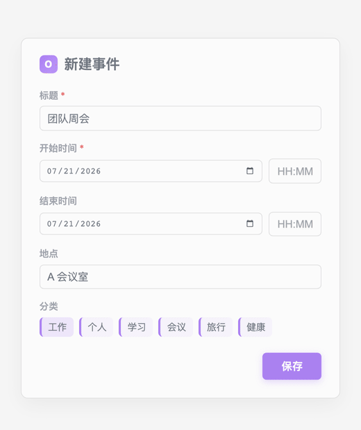
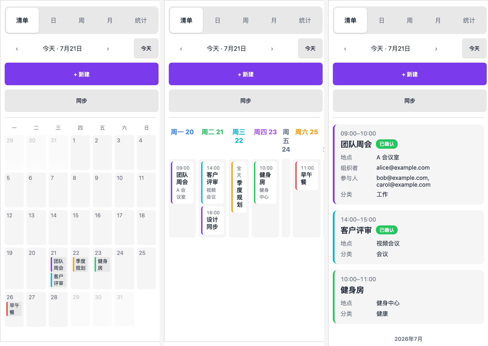

<h1 align="center">Ogenda</h1>

<p align="center">
  <a href="https://github.com/jiang198012/ogenda/releases/latest"></a>
  <a href="https://github.com/jiang198012/ogenda/releases"></a>
  <a href="https://obsidian.md/plugins?id=ogenda"></a>
  <a href="https://github.com/jiang198012/ogenda/stargazers"></a>
  <a href="https://opensource.org/licenses/MIT"></a>
</p>

<p align="center">
  <strong>简体中文</strong> | <a href="./README.en.md">English</a>
</p>

<!--
project: Ogenda
domain: Obsidian 插件 / 日历 / CalDAV 双向同步
audience: Obsidian 用户(桌面端 + 移动端)
runtime: Obsidian 1.7.2+, CalDAV 服务器或 iCloud
status: stable (v1.0.1)
license: MIT
-->

**Ogenda** 是一个 **Obsidian 社区插件**,为 Obsidian 增加专门的**日历/议程面板**。它把事件保存在 Vault 内的**本地 Markdown 月度笔记**中,同时与 **CalDAV / iCloud** 双向同步——日历可随身携带,笔记始终留在你的仓库里。

> ⚠️ **桌面端与移动端均支持**。需要 Obsidian **1.7.2+**。CalDAV 同步需要可访问的服务器地址。

<p align="center">
  
</p>

<p align="center">
  
</p>

> **⭐ 如果你觉得 Ogenda 有用,欢迎 [Star 这个仓库](https://github.com/jiang198012/ogenda),帮助更多人发现它。**

## 功能亮点

| 能力 | 能带来什么 |
| --- | --- |
| **双向同步** | 从 CalDAV / iCloud 拉取事件,把本地修改推回服务器;服务器变更与你的手动笔记合并,绝不覆盖 |
| **本地 Markdown 存储** | 事件按月存入 Vault 的月度笔记,可在事件块下方附加你自己的文字 |
| **五种视图** | 列表 / 日 / 周 / 月 / 统计仪表盘 |
| **事件编辑器** | 分类标签、状态、地点、组织者、参与者、重复规则 |
| **24 小时制时间输入** | 告别 `12:00 AM` 歧义;`1423`、`900` 边打边格式化,键盘输入丝滑 |
| **移动端友好** | 桌面、平板、手机自适应,窄面板 480px 以下自动适配 |
| **双语界面** | 中文 / English 随 Obsidian 语言或插件设置即时切换 |

## 安全与权限

Ogenda 会同步你的日历数据,把它能做什么讲清楚:

**会访问什么?**
- 你配置的 CalDAV / iCloud 凭据(仅保存在 Obsidian 本地设置中)
- 读写 Vault 内你指定的月度事件笔记
- 联网直连你配置的 CalDAV 服务器(iCloud / Nextcloud / Fastmail 等)

**什么时候触发?**
- 点面板的 **Sync**、进行面板操作,或开启「启动时同步」时。插件不会偷跑后台任务。

**怎么控制?**
- 凭据**只发往你配置的那一台服务器**,不经过任何第三方
- 可在设置里关闭「启动时同步」
- 存储文件夹、时区、语言、默认分类都可在设置中调整

## 安装

### 前置条件

- **Obsidian 1.7.2+**(桌面与移动端)
- 同步需要:一个 CalDAV 服务器(iCloud、Nextcloud、Fastmail 等),或开启 **App 专用密码** 的 iCloud 账号

### 从社区插件目录安装(上架后)

1. Obsidian 里打开 **设置 → 社区插件 → 浏览**
2. 搜索 **"Ogenda"** → **安装** → **启用**

### 通过 BRAT 追踪最新版

1. 安装社区插件 **BRAT**
2. BRAT → *Add Beta Plugin* → 填 `jiang198012/ogenda`
3. 在 **设置 → 社区插件** 里启用

### 手动安装

1. 从 [latest release](https://github.com/jiang198012/ogenda/releases/latest) 下载 `main.js`、`manifest.json`、`styles.css`
2. 复制到 Vault 目录下的 `.obsidian/plugins/ogenda/`
3. 重启 Obsidian,在 **设置 → 社区插件** 里启用

## 快速开始

1. 安装并启用插件
2. 打开 **设置 → Ogenda**,选择**同步方式**:`CalDAV` / `iCloud` / `ICS`
3. 填写服务商信息(URL、用户名、密码 / App 专用密码)
4. 选择**存储文件夹**(默认 `Agenda`)
5. 点击面板工具栏的 **Sync(同步)**

首次同步会按月生成 Markdown 文件,例如 `Agenda/2026-07.md`。你可以在事件块下方添加自己的笔记,后续同步会保留这些内容。

## 使用方法

### 打开面板

运行命令 **"Ogenda: Open agenda panel"**,或点击功能区(左侧)的**日历图标**。

### 五种视图

在 **列表 / 日 / 周 / 月 / 统计** 标签之间切换。

### 新建与编辑事件

点击 **New event(新建事件)** 或已有事件卡片进行编辑。支持分类标签、状态、地点、组织者、参与者、重复规则。

### 24 小时制时间输入

时间输入**固定 24 小时制**,与视图显示一致,没有 AM/PM 歧义:

- 输入 `1423` → 边打边自动格式化为 **14:23**;`900` → **09:00**
- 只输入 `9` → 失焦自动补为 **09:00**;`12` → **12:00**
- 午夜 = **00:00**,正午 = **12:00**——早上 9 点到中午 12 点的会议明确是 `09:00 → 12:00`
- 手机端弹出数字键盘,无需滑动找时间

### 时间导航

用 **Today(今天)** 按钮或左右箭头在不同时间之间跳转。

### 同步

点击面板工具栏 **Sync(同步)**,或运行命令 **"Ogenda: Sync now"**,从服务器刷新并推送本地修改。

## 设置

| 分组 | 设置项 | 说明 | 默认值 |
| --- | --- | --- | --- |
| 同步 | 同步方式 | `CalDAV` / `iCloud` / `ICS` / 关闭 | 关闭 |
| | iCloud 账号 | Apple ID 邮箱 | — |
| | iCloud App 专用密码 | 密码字段带显隐开关,说明如何获取 | — |
| | iCloud 日历 | 支持**一键自动发现**,从下拉直接选,不用手抄 URL | — |
| | CalDAV 信息 | URL / 用户名 / 密码 | — |
| | ICS 文件 | 只读导入的 `.ics` 文件 URL | — |
| | 启动时同步 | Obsidian 启动后自动同步一次 | 关 |
| 存储 | 存储文件夹 | 月度事件笔记所在文件夹 | `Agenda` |
| | 时区 | 事件显示时区,默认跟随系统 | 跟随系统 |
| 外观 | 界面语言 | Auto(跟随 Obsidian)/ 简体中文 / English | Auto |
| 分类 | 默认分类 | 新建事件的默认分类标签 | 工作 / Work |

## iCloud 日历自动发现

在设置里填好 Apple ID 与 App 专用密码后,点日历字段旁的**搜索按钮**,插件会直接拉取你账号下的可写日历列表,从下拉菜单选中即可——不必手动复制粘贴 iCloud 的私有日历 URL。

## What's New

**最新版本 v1.0.1**

- **v1.0.1** — **24 小时制时间输入**:事件表单不再跟随系统地区的 12 小时制。时间统一按 `09:00`–`23:59` 输入与显示,中午明确是 `12:00`(绝不再是 `12:00 AM`);`1423`、`900` 这类简写边打边自动格式化,键盘输入更丝滑。
- **v1.0.0** — 首个正式版。**同步引擎加固**:认领服务器已知 UID、增量落盘、写入限速与 503 退避、单条失败不中断整轮;**iCloud 兼容**:定时事件始终携带 DTEND、全天事件默认次日;**移动端可用性**全面改善。
- **v0.0.9** — 同步修复:同步完成后面板自动刷新;CalDAV 请求 30 秒超时;只列出可写事件日历;关闭全天不丢已填时间;存储文件夹即时生效;无法解析的笔记条目给出提示。
- **更早版本** — 详见 [CHANGELOG](CHANGELOG.md)。

## 故障排查(FAQ)

**同步报 401 / 403?**
凭据错误或 App 专用密码不对。在设置中重新输入用户名/密码;iCloud 请使用 App 专用密码(不是登录密码)。

**同步后事件未出现?**
CalDAV URL 错误或账号下没有可写日历。检查 URL,确认账号至少有一个可写的事件日历。

**出现重复事件?**
导入/导出后 UID 冲突。手动删除重复的事件块,然后重新同步。

**移动端布局拥挤?**
Obsidian 边栏太窄。拉宽边栏或旋转设备;Ogenda 在 480px 以下自动适配。

**时间显示成 AM/PM?**
v1.0.1 起时间输入固定 24 小时制。若仍看到 AM/PM,请升级到最新版并重启 Obsidian。

## 开发

```bash
npm install    # 安装依赖
npm run dev    # 开发构建(esbuild watch)
npm run build  # 生产构建(tsc 类型检查 + esbuild 打包)
npm test       # 运行测试(vitest,347 项)
```

## 相关项目

- **Workbuddian** — 同一作者的另一 Obsidian 插件:把本地 CodeBuddy CLI 变成 Vault 里的 AI 聊天助手(流式回复 / `@` 引用 / MCP / 行级 diff 一键撤销)。

## 支持

- 提交 bug 或功能请求:[GitHub Issues](https://github.com/jiang198012/ogenda/issues)(提交前请先看上方 FAQ)

## License

MIT。见 [LICENSE](LICENSE)。
