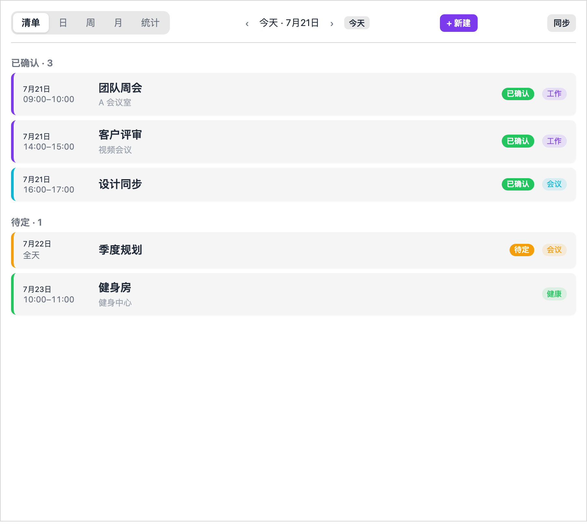
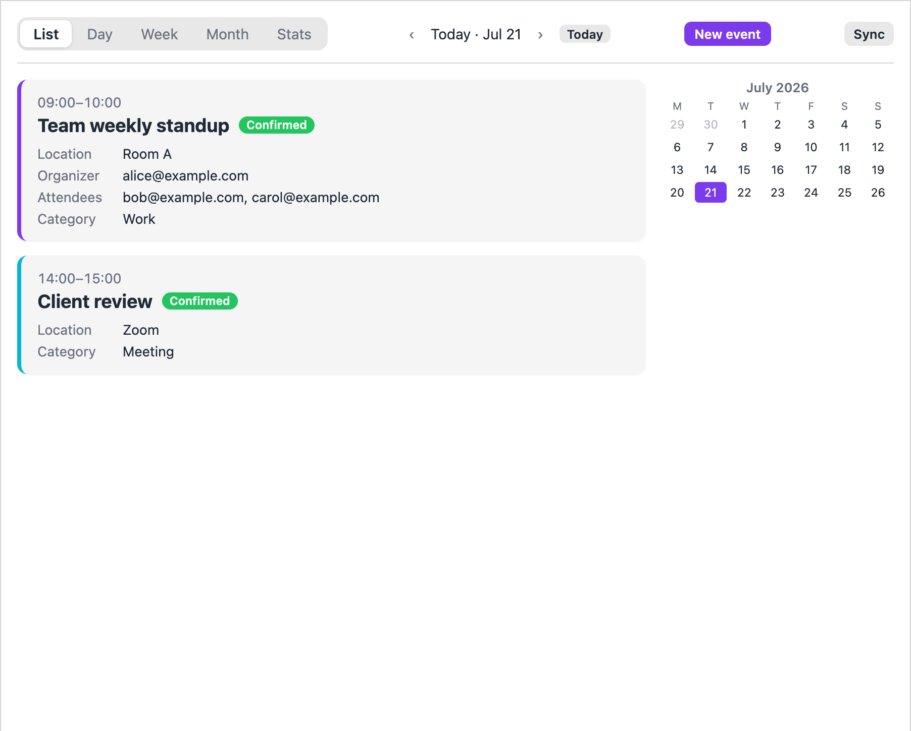
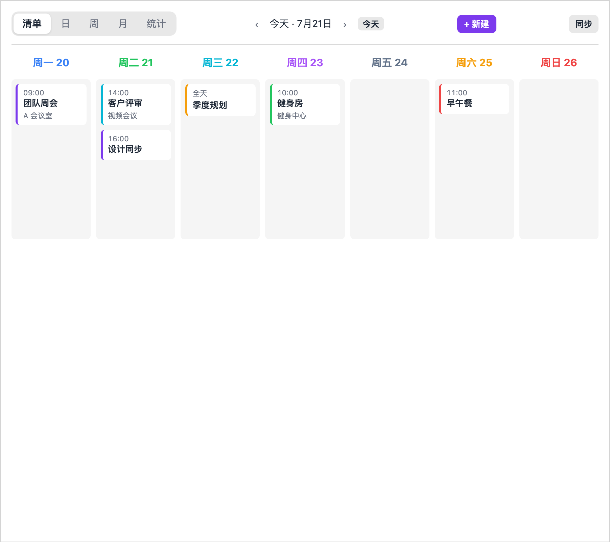
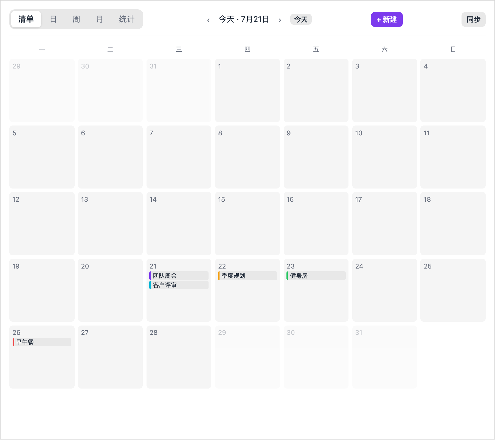
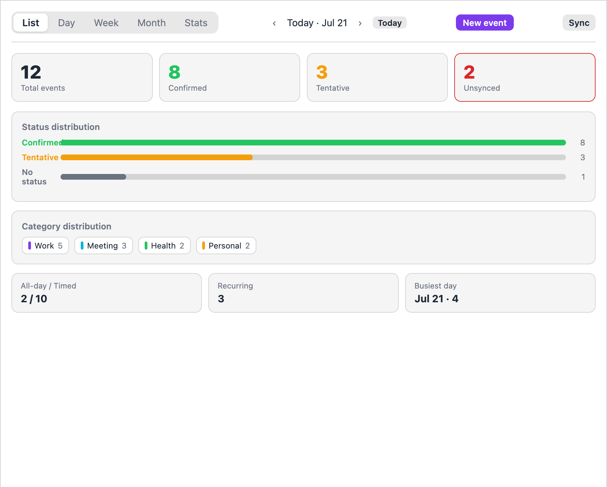
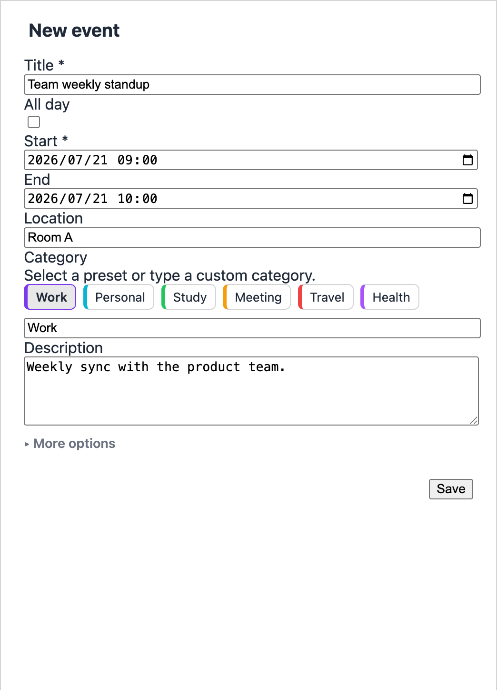
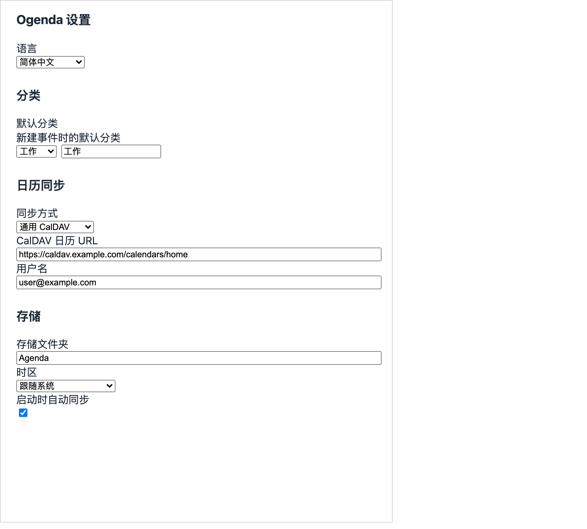
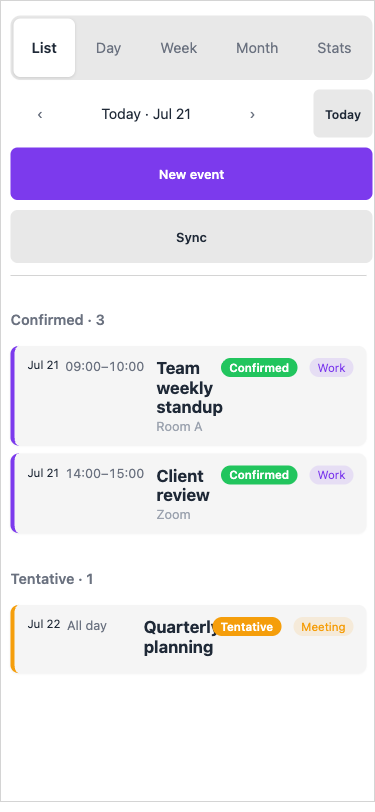

# Ogenda

> Two-way calendar sync (CalDAV / iCloud) with an agenda panel inside Obsidian.

Ogenda adds a dedicated calendar/agenda panel to Obsidian. It keeps your events in local Markdown notes while syncing back and forth with CalDAV or iCloud, so your calendar stays portable and your notes stay in the vault.

> **⚠️ Desktop and mobile are supported.** Obsidian **1.7.2+** is required. CalDAV sync needs a reachable server endpoint.

---

## 📸 Screenshots

| List view | Day view |
| --- | --- |
|  |  |

| Week view | Month view |
| --- | --- |
|  |  |

| Stats view | New event |
| --- | --- |
|  |  |

| Settings | Mobile (375 px) |
| --- | --- |
|  |  |

> If you find Ogenda useful, consider giving the repo a ⭐ — it helps others discover it.

---

## ✨ What’s New

- **v0.0.9** — **Sync fixes**: the panel now refreshes when a sync finishes, so it can no longer show — or let you edit — a version the server has already replaced. A stalled CalDAV request fails after 30s instead of hanging the sync with no notice at all.
- **v0.0.9** — **Calendar picker fixed**: iCloud reports reminder lists as calendars, so the picker used to offer duplicates that could never be written to. Only real event calendars are listed now.
- **v0.0.9** — **Editing fixes**: toggling all-day off keeps the time you had entered; changing the storage folder takes effect without reopening the panel; the list view steps one day at a time; unreadable entries in a monthly note are reported instead of silently skipped.
- **v0.0.8** — **Easier iCloud setup**: the app-specific password and calendar URL fields now tell you where to get the value and show an example format, and a button fetches your iCloud calendars so you can pick one from a dropdown.
- **v0.0.8** — **Show/hide password**: an eye button toggles the iCloud and CalDAV password fields between masked and readable.
- **v0.0.8** — **Month view readability**: day cells keep a minimum and maximum width, and long event titles wrap instead of being clipped.
- **v0.0.7** — **All-day events made simpler**: same-day all-day events are now valid, the end-time hint is removed, and multi-day events are shown on every day they span.
- **v0.0.7** — **Cross-day event display**: timed and all-day events that span midnight now appear on each calendar day they cover.
- **v0.0.6** — **Automated market checks fixed**: release tags now match `manifest.json` exactly, `minAppVersion` is raised to **1.7.2**, and GitHub artifact attestations are produced for every release.
- **v0.0.5** — **Mobile responsive layout**: the agenda panel now adapts to narrow Obsidian side panes and Android/iPhone screens.
- **v0.0.5** — **Category chips**: preset categories with color-coded chips in the event form and event rows.
- **v0.0.5** — **Bilingual UI**: English / 简体中文 labels follow Obsidian locale or the chosen plugin language.

---

## 🚀 Features

- **Two-way sync** — pull from and push to CalDAV / iCloud calendars.
- **Local Markdown storage** — every event lives in a monthly note inside your vault, alongside your own prose.
- **Five views** — List, Day, Week, Month, and Stats dashboards.
- **Event editor** — create and edit events with category chips, status, location, organizer, attendees, and recurrence.
- **Mobile friendly** — works in Obsidian on desktop, tablet, and phone.
- **i18n** — English and Chinese out of the box.
- **Conflict-safe sync** — server changes are merged without overwriting your manual notes.

---

## 📋 Requirements

- Obsidian **1.7.2** or newer.
- For sync: a CalDAV server (iCloud, Nextcloud, Fastmail, etc.) or an iCloud account with app-specific password.

---

## 📦 Installation

### Community plugins (when available)

1. Open **Settings → Community plugins → Browse**.
2. Search for **Ogenda**.
3. Click **Install**, then **Enable**.

### BRAT (beta)

1. Install the [BRAT](https://github.com/TfTHacker/obsidian42-brat) plugin.
2. Open the BRAT settings and add `jiang198012/ogenda`.
3. Enable Ogenda in **Community plugins**.

### Manual

1. Download `main.js`, `manifest.json`, and `styles.css` from the [latest release](https://github.com/jiang198012/ogenda/releases).
2. Copy them into `.obsidian/plugins/ogenda/` inside your vault.
3. Open **Settings → Community plugins**, find **Ogenda**, and enable it.

---

## ⚙️ First-time setup

1. Open **Settings → Ogenda**.
2. Choose your **sync provider**: `CalDAV` or `iCloud`.
3. Fill in the provider details (URL, user, password / app-specific password).
4. Pick a **storage folder** for the monthly event notes (default: `Agenda`).
5. Click **Sync** in the panel toolbar.

The first sync creates one Markdown file per month, e.g. `Agenda/2026-07.md`. You can add your own notes under any event block; Ogenda preserves them on later syncs.

---

## 🖱️ Usage

- Open the command palette and run **Ogenda: Open agenda panel**.
- Switch between **List / Day / Week / Month / Stats** tabs.
- Click **New event** or an existing event card to edit.
- Use the **Today** button or the arrow buttons to move through time.
- Press **Sync** to refresh from the server and push local changes.

---

## 🛠️ Troubleshooting

| Symptom | Likely cause | Fix |
| --- | --- | --- |
| Sync fails with 401/403 | Bad credentials or app-specific password | Re-enter user/password in settings; use an app-specific password for iCloud. |
| Events not appearing after sync | Wrong CalDAV URL or no calendars found | Check the CalDAV URL and verify the account has at least one writable calendar. |
| Duplicate events appear | UID collision after import/export | Delete the duplicate blocks manually and re-sync. |
| Mobile layout looks cramped | Obsidian pane too narrow | Drag the pane wider or rotate the device; Ogenda adapts below 480 px. |

---

## 🙏 Credits

Ogenda is an independent project and is not affiliated with Obsidian or Apple.

---

## License

MIT © jiang

---

# 中文说明

> 在 Obsidian 内部实现双向日历同步（CalDAV / iCloud）的议程面板插件。

Ogenda 为 Obsidian 增加了一个专门的日历/议程面板。它把事件保存在本地的 Markdown 笔记中，同时与 CalDAV 或 iCloud 双向同步，让你的日历可随身携带，笔记始终留在仓库里。

> **⚠️ 支持桌面端与移动端。** 需要 Obsidian **1.7.2+**。CalDAV 同步需要可访问的服务器地址。

## 📸 截图

| 列表视图 | 日视图 |
| --- | --- |
|  |  |

| 周视图 | 月视图 |
| --- | --- |
|  |  |

| 统计视图 | 新建事件 |
| --- | --- |
|  |  |

| 设置 | 移动端（375 px） |
| --- | --- |
|  |  |

> 如果 Ogenda 对你有帮助，欢迎给仓库点个 ⭐，让更多人看到它。

## ✨ 更新日志

- **v0.0.9** — **同步修复**：同步完成后面板会自动刷新，不会再显示、甚至让你编辑一个服务器上已经更新过的旧版本；CalDAV 请求卡住时 30 秒后失败退出，不再无声挂起。
- **v0.0.9** — **日历选择修复**：iCloud 会把提醒事项列表也当作日历返回，导致选择列表里出现重名且无法写入的条目。现在只列出真正的事件日历。
- **v0.0.9** — **编辑修复**：关闭「全天」不再丢失已填的时间；修改存储文件夹无需重开面板即可生效；清单视图改为按天翻页；月度笔记中无法解析的条目会给出提示，不再静默跳过。
- **v0.0.8** — **iCloud 配置更省心**：App 专用密码与日历 URL 字段给出获取路径和示例格式，并新增按钮一键获取 iCloud 日历列表，从下拉中直接选择。
- **v0.0.8** — **密码显隐切换**：iCloud 与 CalDAV 密码字段新增眼睛按钮，可在掩码与明文之间切换。
- **v0.0.8** — **月视图更耐看**：日期格子有了最小与最大宽度，过长的事件标题会自动换行而不再被截断。
- **v0.0.7** — **全天事件更直观**：允许开始和结束为同一天的全天事件，移除结束时间提示中的歧义，跨天日程会在覆盖的每一天都显示。
- **v0.0.7** — **跨天事件展示**：跨越午夜的有时间事件和全天事件，现在会显示在它们覆盖的每个日历日上。
- **v0.0.6** — **修复市场自动化检查**：Release tag 与 `manifest.json` 版本严格一致，`minAppVersion` 提升至 **1.7.2**，并为每次 Release 生成 GitHub 工件来源证明。
- **v0.0.5** — **移动端响应式布局**：议程面板现在能适配窄边栏与 Android / iPhone 屏幕。
- **v0.0.5** — **分类标签**：事件表单和事件行支持带颜色的预设分类标签。
- **v0.0.5** — **双语界面**：英文 / 简体中文标签会根据 Obsidian 语言或插件设置自动切换。

## 🚀 功能

- **双向同步** — 从 CalDAV / iCloud 拉取事件，也可将本地修改推回服务器。
- **本地 Markdown 存储** — 每个事件都保存在仓库的月度笔记中，可附加你自己的文字。
- **五种视图** — 列表、日、周、月、统计仪表盘。
- **事件编辑器** — 使用分类标签、状态、地点、组织者、参与者、重复规则来创建和编辑事件。
- **移动端友好** — 支持桌面、平板和手机上的 Obsidian。
- **国际化** — 内置英文与中文。
- **安全同步** — 服务器变更会与你的手动笔记合并，不会直接覆盖。

## 📋 环境要求

- Obsidian **1.7.2** 或更高版本。
- 若使用同步：CalDAV 服务器（iCloud、Nextcloud、Fastmail 等）或开启应用专用密码的 iCloud 账号。

## 📦 安装

### 社区插件（上架后）

1. 打开 **设置 → 社区插件 → 浏览**。
2. 搜索 **Ogenda**。
3. 点击 **安装**，然后 **启用**。

### BRAT（测试版）

1. 安装 [BRAT](https://github.com/TfTHacker/obsidian42-brat) 插件。
2. 在 BRAT 设置中添加 `jiang198012/ogenda`。
3. 在 **社区插件** 中启用 Ogenda。

### 手动安装

1. 从 [latest release](https://github.com/jiang198012/ogenda/releases) 下载 `main.js`、`manifest.json` 和 `styles.css`。
2. 复制到仓库的 `.obsidian/plugins/ogenda/` 目录下。
3. 打开 **设置 → 社区插件**，找到 **Ogenda** 并启用。

## ⚙️ 首次设置

1. 打开 **设置 → Ogenda**。
2. 选择 **同步方式**：`CalDAV` 或 `iCloud`。
3. 填写服务商信息（URL、用户名、密码 / 应用专用密码）。
4. 选择月度事件笔记的**存储文件夹**（默认：`Agenda`）。
5. 点击面板工具栏的 **Sync（同步）**。

首次同步会按月生成 Markdown 文件，例如 `Agenda/2026-07.md`。你可以在事件块下方添加自己的笔记，后续同步会保留这些内容。

## 🖱️ 使用

- 打开命令面板，运行 **Ogenda: Open agenda panel**。
- 在 **列表 / 日 / 周 / 月 / 统计** 标签之间切换。
- 点击 **New event（新建事件）** 或已有事件卡片进行编辑。
- 使用 **Today（今天）** 按钮或左右箭头在不同时间之间跳转。
- 点击 **Sync（同步）** 从服务器刷新并推送本地修改。

## 🛠️ 常见问题

| 现象 | 可能原因 | 解决方法 |
| --- | --- | --- |
| 同步报 401/403 | 凭据错误或应用专用密码不对 | 在设置中重新输入用户名/密码；iCloud 请使用应用专用密码。 |
| 同步后事件未出现 | CalDAV URL 错误或没有可写日历 | 检查 CalDAV URL，并确认账号下至少有一个可写日历。 |
| 出现重复事件 | 导入/导出后 UID 冲突 | 手动删除重复块，然后重新同步。 |
| 移动端布局拥挤 | Obsidian 边栏太窄 | 拉宽边栏或旋转设备；Ogenda 在 480 px 以下会自动适配。 |

## 🙏 致谢

Ogenda 是独立项目，与 Obsidian 或 Apple 没有关联。

## License

MIT © jiang
